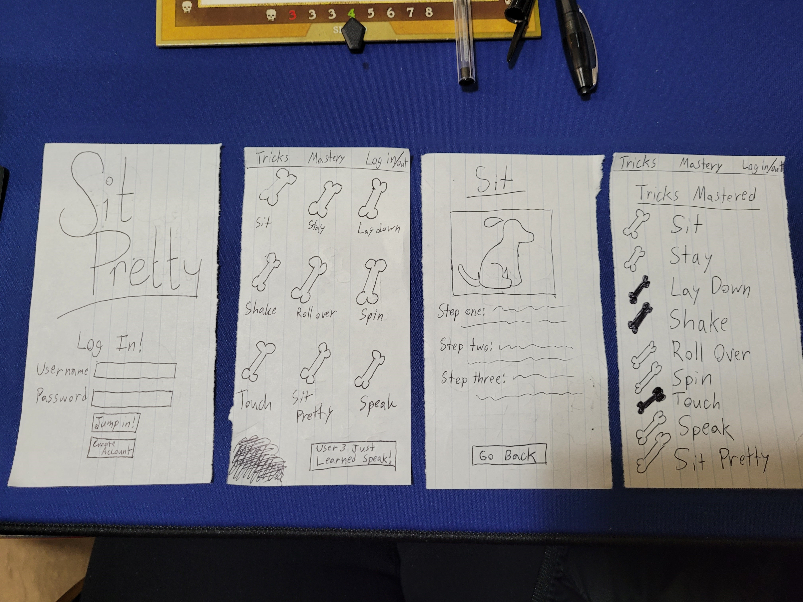

# Sit Pretty Dog Training App
### Elevator Pitch
Picture this: You have a few friends over and your dog meanders by. As your friends gush over how adorable it is, you secretly curse the fact that your dog doesn't know any cool tricks to impress them. Have you ever found youself in this kind of situation? Well, have I got an App idea for you! The Sit Pretty app has step by step instructions that make teaching your dog new tricks easy-peasy. In the app you can mark down which tricks your dog already knows and share them with the community. This is a must-have, easy-to-use app for any dog owner.

### Key Features
- Secure login
- Curated list of tricks preprogrammed into the app
- A list of tricks learned for each user that is editable
- Notifications when a user marks a trick as learned
- Step by Step instructions and pictures for each preprogrammed trick
- Links from each trick in the trick list to the trick instructions

### Design

### Required Technologies
- **HTML** - The Application will be structured using correct HTML. There are three HTML pages, one for login, one for possible tricks to learn, and one for tricks already learned.
- **CSS** - CSS will be used for the styling of the application and will allow it to look good on different screens. 
- **Javascript** - This will be used for the login, the display of tricks to learn, and for editing the list of tricks learned.
- **Service** - The backend server will be used for logging in, submitting tricks learned, and retrieving tricks learned.
- **React** - The application will use the react web framework.
- **Authentication** - A secure registration and login for each user that is stored in the database.
- **Web Socket Data** - When a user marks a trick as learned there is a notification for other users.
- **Database Data** - The list of tricks learned for each user is stored in the database.

### HTML Deliverable
The structure of the application has been built with HTML.

- **HTML Pages** - Three HTML pages that represent the login page, the trick menu, and the checklist of mastered tricks. I plan to use a d
- **Links** - There are navigational links at the top of the three main pages to each of the other pages. The tricks in the trick menu each link to their respective trick page.
- **Text** - Each trick is described with textual steps.
- **Third Party Service Call** - The dog fact on the mastery page is the placeholder for calling a Third Party Service that returns dog facts. 
- **Images** - There are images for each of the trick HTML pages as well as the bullet points and checkboxes will be images in later updates. The yellow bone on the trick page will replace all of the bullet points on the page as well as the checkboxes on the mastery page. When clicked, the yellow bones on the mastery page should turn into the broken green bone signifying that it is completed.
- **Login** - The input box and submit button on the home page are for logging in.
- **Database** - The mastery of tricks checkbox list will be pulled from the database (maintaining the information across the app).
- **WebSocket** - The notifications about other users learning tricks represent the interaction between users through the WebSocket.

[Notes](notes.md)
